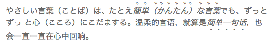

jQuery.emphasis.js
===============

A lightweight javascript fallback for CSS3 [text-emphasis](http://www.w3.org/TR/css-text-decor-3/#emphasis-marks). It’s really useful for East Asian documents. Using small symbols next to each glyph to emphasize a run of text.

Depends on jQuery >= 1.10. Tested on IE 8+, Chrome, Firefox 4+, Safari 5+, Opera 12+, Mobile Safari(iOS 5+)

Getting Started
---
Include jQuery and emphasis plugin into html like this:

    
    
    
    
### .emphasis(text-emphasis)

* text-emphasis Type: String A string representing text-emphasis style. For example: filled, dotted, filled sesame red, "@" #069. You can also use value none to remove the style. It's using navigator.language || navigator.browserLanguage to define which language was used. And it's not supporting vertical writing-mode.

### .emphasis(text-emphasis, text-emphasis-position)

* text-emphasis Type: String A string representing text-emphasis style.

* text-emphasis-position Type: String A string representing text-emphasis-position style. Currently it's not support "right" and "left" in vertical writing-mode.

Know issues
---

* Not support "right" and "left" position.
* Not work right on inline-block element in some case.

If you find more issue, welcome to [report it](https://github.com/zmmbreeze/jquery.emphasis/issues).

LOG
---

* 0.1.0 init
* 0.1.1 changed mainfest, added notation for src file.
* 0.2.0 reconstruction
 fix priority bug
 use grunt
